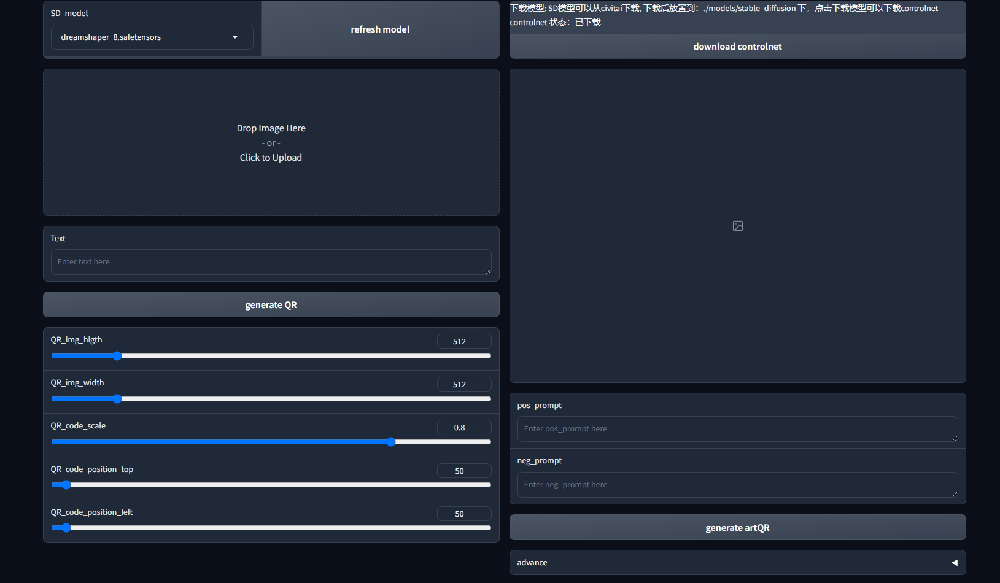

# QR code Beautification

这是一个使用diffusion生成风格化的二维码的项目，使用了stable-diffusion和controlnet模型，可以生成风格化的二维码。

## 运行环境说明

使用前需要先安装python环境:
可以选择安装 anconda 或直接安装 python，安装好后conda使用以下脚本创建虚拟环境：
```shell
conda create -n QR_code python=3.10
conda activate QR_code
```
进一步安装依赖：(直接安装python环境与conda一致)
```shell
pytorch 需要单独安装：
pip install torch==2.1.2 torchvision==0.16.2 torchaudio==2.1.2 --index-url https://download.pytorch.org/whl/cu121
或 (推荐，需要先安装conda)
conda install pytorch==2.1.2 torchvision==0.16.2 torchaudio==2.1.2 pytorch-cuda=12.1 -c pytorch -c nvidia
安装其他依赖
pip install -r requirements.txt -i https://mirrors.aliyun.com/pypi/simple/
```

## 使用


上侧拥有模型选择以及controlnet一键下载，可选择的只有SD模型，SD模型可以从civitai等网站下载
右侧是二维码生成，左侧则是风格化


一些高级设置

包括：采样步数，prompt指导系数，controlnet控制系数，controlnet控制起始与终止，后处理比值

# 效果：

